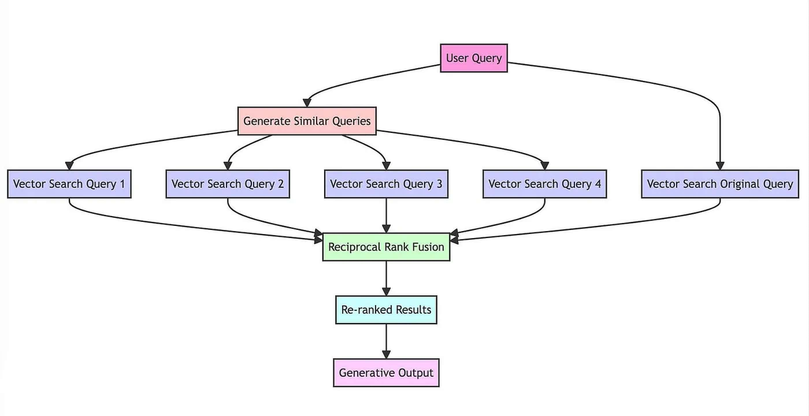

# RAG-Fusion

RAG-Fusion aims to narrow the divide between users' explicit queries and their underlying intentions, moving towards the revelation of valuable insights that are often concealed.

In this repository, you will find RAG-Fusion's implementation using Langchain, Weaviate and OpenAI.

This work is inspired by the original RAG-fusion repository: https://github.com/Raudaschl/rag-fusion

Check out this Medium article for a detailed explanation: 
